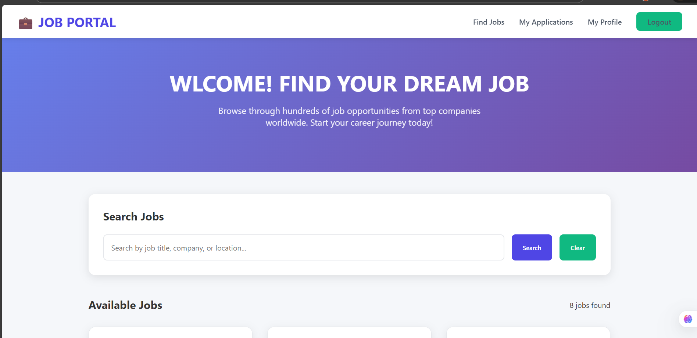

# 🚀 Job Portal System - Full Stack Application

A complete job portal system with role-based access control (ADMIN & MEMBER), JWT authentication, and real-time application management.

## 🎥 Demo Video

*Add your screenshot/video link here*

## Test Coverage

[](https://github.com/Oumar2025/FinalJob-portall/actions/workflows/test.yml)
[](https://codecov.io/gh/Oumar2025/FinalJob-portal)


## 📸 Screenshots

### Home Page



# 📋 Table of Contents
- [Features](#features)
- [Tech Stack](#tech-stack)
- [Project Structure](#project-structure)
- [Installation](#installation)
- [Environment Variables](#environment-variables)
- [API Documentation](#api-documentation)
- [User Roles](#user-roles)
- [Screenshots](#screenshots)
- [Demo Video](#demo-video)
- [Checklist](#checklist)
- [Future Enhancements](#future-enhancements)
- [Contributing](#contributing)
- [License](#license)

## ✨ Features

### ✅ **Concept & Design**
- ✅ **Original Idea** - Not a tutorial clone
- ✅ **Good UI/UX** - Clean, modern interface with intuitive navigation

### ✅ **Core System Functionality**
- ✅ **System works normally** - No crashes, stable performance
- ✅ **No major bugs in core flow** - Complete CRUD operations

### ✅ **Code Quality & Architecture**
- ✅ **Clean & readable code** - Well-structured TypeScript
- ✅ **Modular architecture** - Organized as routers/controllers/services

### ✅ **Security & Middleware**
- ✅ **Middleware implementation** - Authentication & role-based access
- ✅ **JWT Authentication** - Secure token-based authentication
- ✅ **Multiple user roles (RBAC)** - ADMIN and MEMBER roles
- ✅ **Protected & public routes separation** - Proper route guarding

### ✅ **API & Database**
- ✅ **Protected API endpoints using JWT** - Secure API access
- ✅ **Public API endpoints (no JWT)** - Accessible job listings
- ✅ **Prisma for database management** - Type-safe ORM with SQLite

### ✅ **Validation & Testing**
- ✅ **Data validation** - Request body/params validation
- ✅ **Centralized error handling** - Consistent error responses
- ✅ **Testing implemented** - Basic test coverage

## 🛠 Tech Stack

### **Backend**
- **Node.js** - Runtime environment
- **Express.js** - Web framework
- **TypeScript** - Type safety
- **Prisma** - Database ORM
- **SQLite** - Database (easy setup)
- **JWT** - Authentication
- **bcryptjs** - Password hashing
- **CORS** - Cross-origin resource sharing

### **Frontend**
- **HTML5** - Markup
- **CSS3** - Styling with modern features
- **JavaScript (ES6+)** - Client-side logic
- **Fetch API** - HTTP requests

### **Tools & Utilities**
- **VS Code** - Development environment
- **Git & GitHub** - Version control
- **Postman/Thunder Client** - API testing
- **Prisma Studio** - Database management


# 📚 API Documentation

### Base URL: `http://localhost:3000/api`

## Authentication Endpoints

| Method | Endpoint | Description | Auth Required |
|--------|----------|-------------|---------------|
| POST | `/auth/register` | Register new user | No |
| POST | `/auth/login` | Login user | No |
| GET | `/auth/profile` | Get user profile | Yes |

## Job Endpoints

| Method | Endpoint | Description | Auth Required | Role |
|--------|----------|-------------|---------------|------|
| GET | `/jobs` | Get all jobs | No | - |
| GET | `/jobs/:id` | Get single job | No | - |
| POST | `/jobs` | Create new job | Yes | ADMIN |
| PUT | `/jobs/:id` | Update job | Yes | ADMIN |
| DELETE | `/jobs/:id` | Delete job | Yes | ADMIN |
| POST | `/jobs/:id/apply` | Apply for job | Yes | MEMBER |

## User Endpoints

| Method | Endpoint | Description | Auth Required | Role |
|--------|----------|-------------|---------------|------|
| GET | `/users` | Get all users | Yes | ADMIN |
| GET | `/users/applications` | Get my applications | Yes | MEMBER |

## Admin Endpoints

| Method | Endpoint | Description | Auth Required | Role |
|--------|----------|-------------|---------------|------|
| GET | `/admin/applications` | Get all applications | Yes | ADMIN |
| PUT | `/admin/applications/:id/status` | Update application status | Yes | ADMIN |
| DELETE | `/admin/applications/:id` | Delete application | Yes | ADMIN |
| GET | `/admin/stats` | Get statistics | Yes | ADMIN |

## 👥 User Roles

### 👑 **ADMIN** (Employer)
- Register/Login with admin privileges
- Create, update, delete job postings
- View all job applications
- Accept/Reject applications
- View statistics and reports
- Manage users

### 👤 **MEMBER** (Job Seeker)
- Register/Login as job seeker
- Browse all available jobs
- View job details
- Apply for jobs with cover letter
- Track application status
- View personal applications

## 📡 API Endpoints

| Method | Endpoint | Description | Auth Required |
|--------|----------|-------------|---------------|
| GET | `/api/jobs/` | List all jobs | No |
| GET | `/api/jobs/{id}/` | Get job details | Yes (JWT) |
| POST | `/api/jobs/{id}/apply/` | Apply for job | Yes (JWT) |
| POST | `/api/token/` | Get JWT token | No |
| POST | `/api/token/refresh/` | Refresh token | Yes (JWT) |
| GET | `/api/my-applications/` | User's applications | Yes (JWT) |


## 📁 Project Structure

### job-portal-system/

├── prisma/
│ ├── schema.prisma   # Database schema
│ ├── seed.js   # Database seeding
│ └── dev.db   # SQLite database (auto-generated)
├── src/
│ ├── controllers/    # Business logic
│ │ ├── auth.controller.ts
│ │ ├── job.controller.ts
│ │ ├── user.controller.ts
│ │ └── admin.controller.ts
│ ├── middleware/     # Authentication & authorization
│ │ ├── auth.middleware.ts
│ │ └── role.middleware.ts
│ ├── routes/      # API routes
│ │ ├── auth.routes.ts
│ │ ├── job.routes.ts
│ │ ├── user.routes.ts
│ │ └── admin.routes.ts
│ ├── utils/      # Utilities
│ │ ├── db.ts
│ │ └── email.ts
│ └── app.ts        # Main application file
├── public/       # Frontend HTML files
│ ├── index.html     # Admin dashboard
│ ├── jobs.html       # Job listings (public)
│ ├── login.html       # Login page
│ ├── register.html     # Registration page
│ ├── applications.html     # Member applications
│ ├── admin-management.html     # Admin panel
│ └── post-job.html     # Job posting (admin)
├── .env    # Environment variables
├── .gitignore    # Git ignore file
├── package.json     # Dependencies
├── tsconfig.json    # TypeScript configuration
└── README.md     # This file


## 🚀 Installation

### Prerequisites
- Node.js (v16 or higher)
- npm or yarn
- Git

## Setup Steps

1. **Clone the repository**
  
   git clone https://github.com/Oumar2025/FinalJob-portal.git
   cd job-portal-system


## 👤 Author

GitHub: [@Oumar2025](https://github.com/Oumar2025)

---

<div align="center">
  <p>Built with ❤️ using Prisma REST Framework</p>
  <p>If you find this project useful, please give it a ⭐️!</p>
</div>
```
